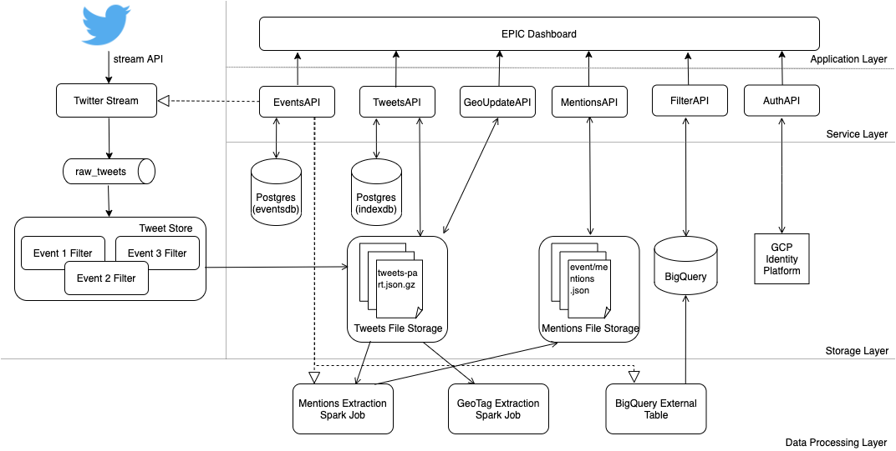

# EPIC Infrastructure

EPIC Infrastructure backend mono repo. Contains all services, kubernetes deployment files, dataproc definitions...

## Diagram

## Overview

This project is prepared to run on top of a pre-configured Kubernetes cluster. Basic knowledge of Kubernetes is required. A good start is this [Udacity course](https://www.udacity.com/course/scalable-microservices-with-kubernetes--ud615). The project is structured into 2 separate parts: collection pipeline services and dashboard services. 

### Collection Pipeline Services

This side is in charge of connecting to Twitter and collecting tweets 24/7. It has 2 services: [_TwitterStream_](/TwitterStream) (downloads tweets and sends to Kafka) and [_tweet-store_](/tweet-store) (receives tweets from Kafka and uploads them to Google Cloud Storage). 

Tweets are stored following a `EVENT/YYYY/MM/DD/HH/` folder structure (a tweet received at 2PM on April 3rd 2019 for event _winter_ would be stored in the folder `winter/2019/04/03/14`) in a the `epic-collect` Google Cloud bucket. Each tweet received is buffered. When the buffer reaches size of 1000 tweets a file is created and uploaded in the corresponding folder.

------------
# Requirements
List of requirements for deploying or developing in this repository.

## Development

In order to work on the services you will need the following:
- Installed java 8. (Ex: `brew install java8`)
- Installed maven. (Ex: `brew install mvn`)
- Installed Make (Ex: `brew install make`)
- Install our authlib: `cd authlib && mvn install`.
- Set up your local Maven installation to pull from GitHub repository (read how to do so [here](https://help.github.com/en/articles/configuring-apache-maven-for-use-with-github-package-registry#authenticating-to-github-package-registry))
- Log in on your GCloud CLI. `gcloud auth login`
- Create a default token using your GCloud user. `gcloud auth application-default login`

## Deploying

In order to deploy you will need:
- Docker CLI installed (Ex: `brew install docker`)
- A [hub.docker.com](https://hub.docker.com/) account and your Docker CLI connected to it (`docker login`)
- Editor access to [Project EPIC Docker Hub organization](https://cloud.docker.com/orgs/projectepic/teams).
- Editor access to the GCloud project.
- `kubectl` installed (Ex: `brew install kubectl`)
- `kubectl` connected to the corresponding cluster (Project EPIC: `gcloud container clusters get-credentials epic-prod --zone us-central1-c --project crypto-eon-164220`)
------
# New service

## Start development

Requirements: [Development requirements](#development)
- Read [Getting started guide for DropWizard](https://www.dropwizard.io/1.3.14/docs/getting-started.html)
- `mvn archetype:generate -DarchetypeGroupId=io.dropwizard.archetypes -DarchetypeArtifactId=java-simple -DarchetypeVersion=1.3.9`
- Add AuthLib as a dependency (follow instructions [here](authlib/#install-on-service))
- Add authentification on your service (follow instructions [here](authlib/#install-on-service))
- Add CORS configuration (see instructions [here](authlib#cors-specification))
- Add Makefile to service (you can copy from the [Makefile template](templates/Makefile)
- Add Dockerfile to service (you can copy from the [Dockerfile template](templates/Dockerfile)
- Add root resource under resources folder and register it on the application (you can copy root resource from the [EventsAPI example](EventsAPI/src/main/java/edu/colorado/cs/epic/eventsapi/resource/RootResource.java)
- Add `config.yml` file copying from [this template](templates/config.yml)
- Set up your configuration to retrieve production key-value (see [this example](MediaAPI/src/main/java/edu/colorado/cs/epic/mediaapi/MediaAPIConfiguration.java))
- Set up your application to get [configuration parameters from environment variables](https://www.dropwizard.io/0.8.0/docs/manual/core.html#environment-variables)
- Run project locally: `make run`

## Deployment

- (ONLY FIRST TIME) Create new Kubernetes [definition file](templates/api.yml) in the [api folder](kubernetes/api)
- Make sure your resources are protected with the right annotations (see how to do it [here](authlib#protect-resources))
- Make sure you have [health checks](https://www.dropwizard.io/0.8.0/docs/manual/core.html#health-checks) configured properly for external dependencies
- Update image version in `Makefile`
- Create and upload docker image: `make push`
- Update docker image version in your [api definition file](kubernetes/api)
- `kubectl replace -f api/NEW.yml` (replace NEW with your api file name)

------
# System deployment

- Create managed Postgres instance (see [cloudsql instructions](./cloudsql))
- Create Dataproc workflow (see [dataproc instructions](./dataproc))
- Create a Kubernetes cluster and deploy services (see [kubernetes instructions](./kubernetes))

-----

# Queries

How to run diverse queries on the system with new and old data.

## Collection query

Streaming collection for events happenning at the moment

- Open [dashboard.gerard.space](https://dashboard.gerard.space)
- Select _Events_ on side bar.
- Press the pink button on the left-down corner
- Fill form with information on event and use keywords field to add keywords to collect from. Read more about how Twitter tracking works [here](https://developer.twitter.com/en/docs/tweets/filter-realtime/guides/basic-stream-parameters#track)

## BigQuery query

- Open desired table (see sections below)
- Click _Query table_
- Build SQL statement for the query we are interested in. See [syntax here](https://cloud.google.com/bigquery/docs/reference/standard-sql/query-syntax).
- Run query
- Download data by clicking _Save results_

### Open table for new infrastructure event

Query on an event collected in the new infrastrucure

- Open [dashboard.gerard.space](https://dashboard.gerard.space)
- Select _Events_ on side bar.
- Select event to query
- Select _Dashboard_ tab on top
- (ONLY FIRST TIME) Click _Create BigQuery Table_ 
- Click _Explore in BigQuery_

## Open table on legacy imported events

- Open [historic dataset](https://console.cloud.google.com/bigquery?project=crypto-eon-164220&p=crypto-eon-164220&d=historic&page=dataset) in BigQuery
- If table exists: [Execute query](#bigquery-query)
- Else:
- Click _Create table_
- Set table configuration to the following (if not specified, leave as defaulted):
  - _Create table from_: "Google Cloud Storage"
  - _Select file..._: Browse file in `epic-historic_tweets` bucket, in the corresponding folder and select one file. Replace filename with wildcard instead (Ex: `epic-historic-tweets/2012 Canada Fires/*`)
  - _File format_: "JSON (newline delimited)"
  - _Table type_: "External table"
  - _Table name_: Fill with a distinct table name
  - Check _Auto detect - Schema and input parameters_ box
  - _Advanced options_:
    - _Number of errors allowed_: 2147483647
    - Check _Ignore unknown values_ box
-  Click _Create table_

------

## Frequent errors

**Google Cloud is giving an authorization error on local**

- Log in on your GCloud CLI. `gcloud auth login`
- Make sure you have been added to the proper Google Cloud project.
- Create a default token using your GCloud user. `gcloud auth application-default login`
- Make sure you don't have any *GOOGLE_APPLICATION_CREDENTIALS* environment variable set.
